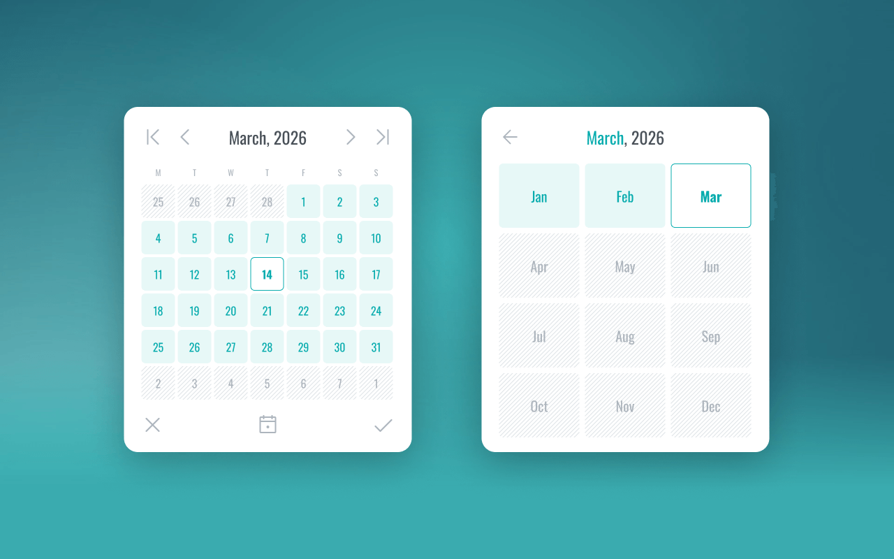

# qCalendar

qCalendar is a beautiful & simple calendar date picker in TypeScript designed to be beautifully simple, intuitive and lightweight. It is build to be accessible and using modern semantic markup.

**Demo coming soon**

## Design

Designed and prototyped in Figma, you can see the basic interactions to see what it looks like.

### Figma prototype

https://www.figma.com/proto/lv1vTydLdjuYLOuKXEv8Ek/Calendar---Date-Picker-UI?page-id=0%3A1&node-id=6-163&viewport=3641%2C1030%2C1&t=WwmvSZbOYIhRwV3l-1&scaling=min-zoom&content-scaling=fixed&starting-point-node-id=6%3A163

## Development

Built in TypeScript and using SCSS, it uses Vite to help build and test changes quickly.

## Designer & Author

qCalendar was designed and developed by Stewart Orr (https://www.stewartorr.co.uk).

## Credits

The icons are from the beautiful library [Phosphor Icons](https://phosphoricons.com/).